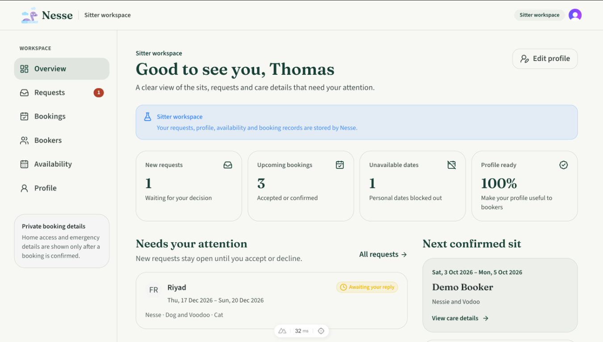

# Nesse

Nesse is a private, mobile-first web app for coordinating house- and pet-sitting between a sitter and the people invited to book them. It keeps availability, booking requests, agreed handover times, care details, updates, expenses, and cancellations together in one shared record.

Nesse is a scheduling and record-keeping tool. It is not a public sitter marketplace, payment processor, emergency-response service, or source of legal advice.

## Sitter workspace demo

The screenshot below shows the sitter overview: a summary of new requests, upcoming bookings, unavailable dates, profile completion, and the next confirmed sit.



## Features

### Private accounts and profiles

- Sign-in is handled by Clerk.
- The app is configured for one sitter; the sitter can invite bookers with single-use, expiring invite links.
- Sitter profiles are private to invited bookers and include a bio, general location, contact number, accepted pets, rate and rate basis, and optional paid services.
- Exact home access details and other sensitive instructions are kept out of the public-facing profile.

### Booker experience

- View the invited sitter's profile and availability.
- Request a stay by choosing arrival and departure dates, preferred handover times, pets, care requirements, and proposed expense terms.
- Review the request before submitting it, then follow its status from the bookings area.
- See booking-only care, contact, property, and emergency details after the booking is confirmed.

### Sitter workspace

- See outstanding requests, upcoming bookings, unavailable dates, profile completion, and the next confirmed sit from the overview.
- Review requests and accept or decline them.
- Manage a private sitter profile, rates, accepted pets, and optional services.
- Block, amend, and remove unavailable date ranges, with checks against existing bookings and blocks.
- Review booking records and manage confirmed stays.

### Booking lifecycle and care coordination

- Track explicit booking states, including requested, declined, accepted with handover times pending, confirmed, cancelled, and completed.
- Keep requested arrival/departure times distinct from the sitter's agreed times.
- Prevent date conflicts with unavailable periods and other bookings that hold dates.
- Explicitly cancel a booking and retain the cancellation record; a lack of response does not accept or cancel a request.
- Add dated progress updates during a confirmed stay.
- Record agreed rates, travel reimbursement, and incidental expenses separately. The sitter can add a receipt to an expense when useful.
- Attach private photos to eligible bookings. Attachments are ownership-checked and validated by the server.

### Privacy and operational safeguards

- Booking-only property and emergency details are withheld until the booking is confirmed or completed.
- Booking attachments and receipts are stored outside the database in a private file directory; their filesystem paths are not exposed by the API.
- Uploads are limited to 10 MiB per file. Receipts support PDF, JPEG, and PNG; photos support JPEG, PNG, and WebP.
- SQLite migrations are versioned and checksummed. The project includes database status, migration, seed, backup, backup verification, and restore commands.

## Technology

- Nuxt 4, Vue 3, TypeScript, Tailwind CSS, and Nuxt UI
- Clerk authentication
- SQLite using Node.js's built-in `node:sqlite`
- Zod schemas shared between API validation and the frontend
- Vitest for automated tests

## Get started

The Nuxt application is in [`src/`](./src/).

**Requirements:** Node.js 24 or later and npm. Clerk environment keys are needed for authenticated use; see the [application setup guide](./src/README.md) for configuration and development instructions.

```bash
cd src
npm install
npm run dev
```

The development server starts at <http://localhost:3000>. To run the tests and type check:

```bash
npm test
npm run typecheck
```

For architecture, API endpoints, database configuration, migrations, backup and restore procedures, see the [application documentation](./src/README.md).

## Scope and current limitations

- Access is invite-only; Nesse is not designed for public sitter discovery, search, reviews, or ratings.
- Nesse records agreed rates and expenses but does not collect payments, pay sitters, issue invoices, or settle reimbursements.
- A receipt documents an expense; it is not evidence of attendance.
- Booking status is available in the app, but automated email, SMS, and push notifications are not currently included.
- The default private-file storage is local to one deployment and requires a persistent, access-controlled volume. Database backups do not include uploaded files; see the [backup guidance](./src/README.md#backups).
- External calendar sync, background checks, and payment processing are not part of the current app.

Product intent and first-release requirements are documented in [resources/requirements.md](./resources/requirements.md). Design references are in [resources/design-poc/](./resources/design-poc/).
